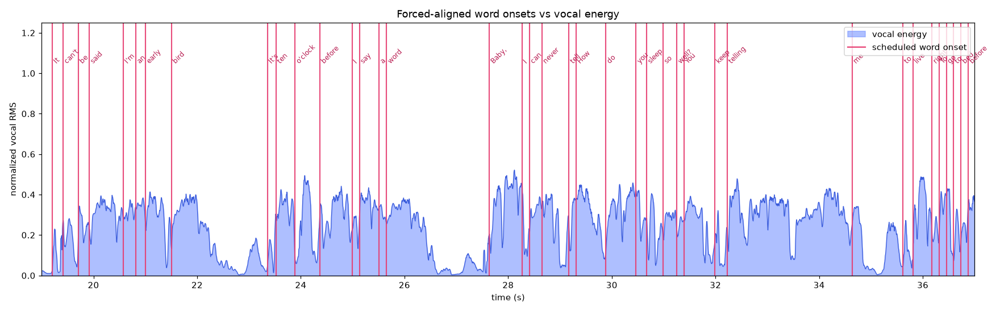

# Reel Studio — Beat-Reactive Music Visuals

Drop a song (or paste a link) and Reel Studio extracts the **stems**, reads the
**genre, mood, energy, tempo and key**, **forced-aligns the lyrics** to the vocal, and
**auto-directs a vertical (1080×1920) visual** tailored to that track — ready to export as
MP4 for Reels/Shorts. It's a local app: a small Python backend does the analysis, a
browser front-end does the visuals.



## Quick start

```bash
# one-time: create the venv + install deps
cd tools && python3 -m venv .venv && source .venv/bin/activate && pip install -r requirements.txt && cd ..

# start the app (also auto-creates the venv on first run)
./run.sh
```

Open **http://localhost:8000**, then either:
- **drop an audio file** (mp3/wav/flac/m4a/…), or
- **paste a URL** (YouTube / SoundCloud / direct audio link).

Reel Studio downloads/normalizes the audio, runs the pipeline with a live progress bar,
then opens the visualizer with the detected genre/key/BPM and an auto-selected
preset + color palette + intensity. Press **Play**, tweak the preset/theme/intensity, and
**Export MP4**.

> First analysis downloads the models once (Demucs ~80 MB, the forced-aligner ~1.2 GB,
> the PANNs tagger ~300 MB), cached afterwards. A 3–4 min song analyzes in ~1–3 min on CPU.
> Note: YouTube may require browser cookies to download from some networks/IPs.

## What it analyzes

Every song becomes an **analysis pack** (`manifest.json` + `envelopes.json` +
`word_schedule.json` + `lyrics.json` + Demucs stems):

- **Stems** — Demucs `htdemucs` (vocals / drums / bass / other) drive per-band reactivity.
- **Tempo / key** — librosa beat tracking + Krumhansl-Schmuckle key detection.
- **Energy / mood** — RMS dynamics, brightness, danceability, valence/arousal.
- **Genre / mood / instrument tags** — PANNs AudioSet classifier.
- **Lyrics** — fetched from LRCLIB and **CTC forced-aligned** to the vocal stem
  (word-accurate karaoke; see below).
- **Animation blueprint** — recommended preset, theme/palette, intensity, motion + a
  human-readable prompt, written to `manifest.animation`. The visualizer applies it
  automatically so visuals are niche to each song.

## Forced-aligned lyrics (word-perfect karaoke)

Word timing uses **CTC forced alignment** of the known lyrics against the Demucs vocal
stem (torchaudio `MMS_FA`) — far more accurate than ASR timestamps. Each lyric line is
aligned within its own short window, anchored by the **human LRC line timestamps** when
the lyrics are synced (else by whisper), and word starts are snapped onto the vocal-energy
onsets. On a synthetic ground-truth fixture this reaches **~17 ms median onset error**
(>90% of words within 80 ms).

### Command-line / batch use

The same pipeline is available as a CLI (writes an `Artist - Title.analysis/` pack):

```bash
python tools/analyze_song.py "Artist - Title.mp3"            # LRCLIB auto-fetch
python tools/analyze_song.py "song.mp3" --lyrics words.lrc   # explicit lyrics
```

Flags: `--align {forced,whisper,hybrid}` (default `forced`),
`--anchor {auto,lrc,whisper,none}` (default `auto`), `--lyric-lead`, `--no-insights`,
`--device {cpu,cuda}`, `--background`.

### Validation tooling (`tools/`)

- `make_ground_truth.py` — synthesize a vocal with exact known word times (`--hard` adds
  reverb + a denser mix). `eval_alignment.py` — onset error vs that ground truth.
- `eval_lrc_lines.py` — real-audio line-onset error vs human LRCLIB timestamps.
- `plot_alignment.py` — overlay word onsets on the vocal energy (see `docs/alignment/`).

## Architecture

```
server/app.py        FastAPI: upload/URL ingest, job queue + progress, serves packs + UI
tools/pipeline/      run.py (orchestration) · separate (Demucs) · forced_align · profile ·
                     insights (genre/mood/key + blueprint) · lyrics_fetch (LRCLIB) · envelopes
index.html, css/, js/  GUI + p5.js visualizer; consumes the backend pack only
```

The browser does **no** analysis — it renders the backend pack. Stems/audio are served
under `/data/<job>/`; packs are gitignored and regenerated on demand.

## Export

- **MP4** (1080×1920) for Instagram/Shorts, with audio+video fade in/out sliders.
- Click Export → Stop & Save when done.

## License

Personal use. Ensure you have rights to the music and lyrics you use.
